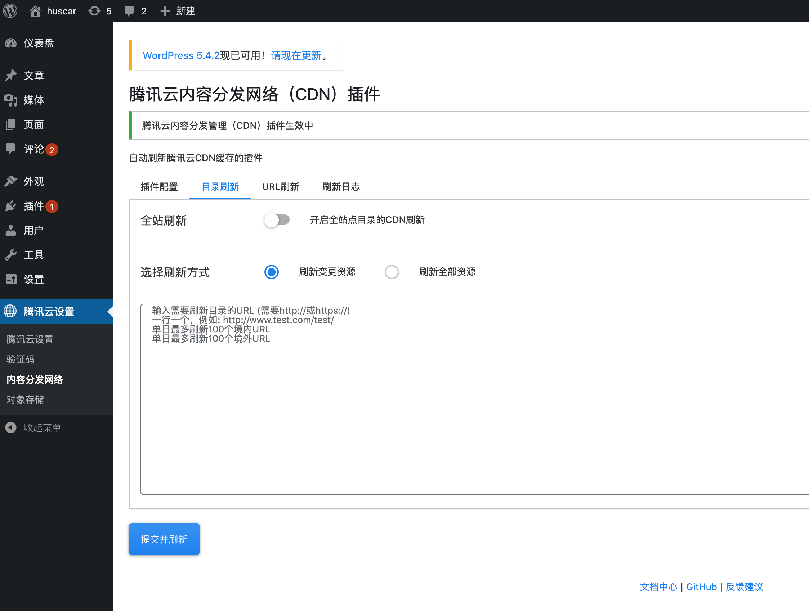
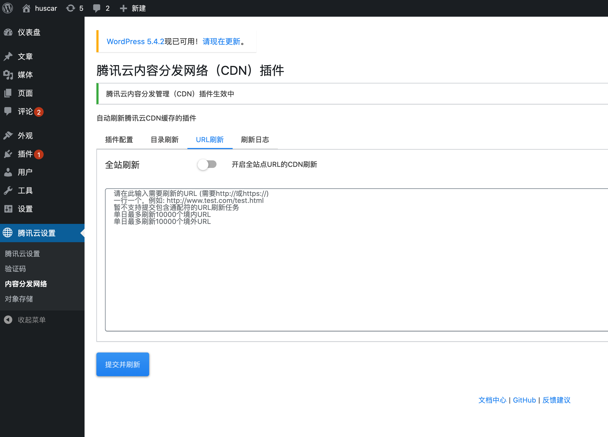

# 腾讯云CDN插件

## 1.插件介绍
> 一款自动刷新腾讯云CDN缓存的插件。

| 标题       | 名称                                                         |
| ---------- | ------------------------------------------------------------ |
| 中文名称   | 腾讯云内容分发网络（CDN）插件                                    |
| 英文名称   | tencentcloud-cdn                                      |
| 最新版本   | 1.0.2 (2020.12.11)                                       |
| 适用平台   | [WordPress](https://wordpress.org/)                          |
| 适用产品   | [腾讯云内容分发网络（CDN）](https://cloud.tencent.com/product/cdn)            |
| GitHub项目 | [tencentcloud-wordpress-plugin-cdn](https://github.com/Tencent-Cloud-Plugins/tencentcloud-wordpress-plugin-cdn) |
| 主创团队   | 腾讯云中小企业产品中心（SMB Product Center of Tencent Cloud）     |
| 反馈地址   | 请通过[咨询建议](https://support.qq.com/products/164613)向我们提交宝贵意见  |

## 2.功能特性

- 发布或更新文章时，将自动刷新文章页、首页、分类列表页、标签列表页相关URL缓存。
- 发表评论或评论被审批后，将自动刷新文章页CDN缓存。
- 新增CDN目录刷新和URL刷新功能。
- 新增刷新日志查询功能。
## 3.安装指引

### 3.1.部署方式一：通过GitHub部署安装
> 1. git clone https://github.com/Tencent-Cloud-Plugins/tencentcloud-wordpress-plugin-cdn
> 2. 复制tencentcloud-wordpress-plugin-cdn 目录中tencentcloud-cdn文件夹拷贝到wordpress安装路径/wp-content/plugins/文件夹里中

### 3.2.部署方式二：通过WordPress官网插件中心下载安装

> 1. 前往[WordPress插件中心](https://wordpress.org/plugins/tencentcloud-cdn/)点击下载
> 2. 你的WordPress站点后台=》插件=》安装插件。点击左上角的"上传插件"按钮，选择上一步下载的zip安装包

### 3.3.部署方式三：通过本地WordPress站点插件中心部署安装

> 1. 你的WordPress站点后台=》插件=》安装插件。在页面搜索框输入tencentcloud-cdn
> 2. 点击"安装"按钮，就会自动下载安装插件
## 4.使用指引

### 4.1.界面功能介绍

> 1. 控制是否打开自定义用户密钥
> 2. 输入腾讯云账号的secretId 和 SecretKey 的信息后保存配置
> 3. 接口测试按钮可以测试腾讯云账号的CDN服务是否正常开启

> 1. 可对站点目录的CDN进行全局刷新或部分刷新

> 1. 可对站点URL的CDN进行全局刷新或部分刷新

> 1. 可查询某一时间段内站点的CDN刷新记录

### 4.2.名词解释
- **自定义密钥**：插件提供统一密钥管理，既可在多个腾讯云插件之间共享SecretId和SecretKey，也可为插件配置单独定义的腾讯云密钥。
- **SecretId**：在腾讯云云平台API密钥上申请的标识身份的SecretId。详情参考[腾讯云文档](https://cloud.tencent.com/document/product)
- **SecretKey**：在腾讯云云平台API密钥上申请的标识身份的SecretId对应的SecretKey。详情参考[腾讯云文档](https://cloud.tencent.com/document/product)
- **刷新变更资源**：刷新旧的缓存资源并生成更新后资源。
- **刷新全部资源**：刷新旧的缓存资源但不会更新最新资源。
## 5.获取入口

| 插件入口          | 链接                                                         |
| ----------------- | ------------------------------------------------------------ |
| GitHub            | [link](https://github.com/Tencent-Cloud-Plugins/tencentcloud-wordpress-plugin-cdn)    |
| WordPress插件中心  | [link](https://wordpress.org/plugins/tencentcloud-cdn) |
## 6.FAQ

> 暂无

## 7.版本迭代记录

### 2020.12.11 tencentcloud-wordpress-plugin-cdn v1.0.2
- 支持在windows环境下运行

### 2020.7.15 tencentcloud-wordpress-plugin-cdn v1.0.1
- 新增CDN目录刷新和URL刷新功能。
- 新增刷新日志查询功能。

### 2020.6.22 tencentcloud-wordpress-plugin-cdn v1.0.0
- 发布或更新文章时，将自动刷新文章页、首页、分类列表页、标签列表页相关URL缓存。
- 发表评论或评论被审批后，将自动刷新文章页CDN缓存。

## 8.致谢
- 该插件参考了wordpress插件[zhanzhangb-tcdn](https://de.wordpress.org/plugins/zhanzhangb-tcdn)的实现方法，特此对其主创团队进行致谢。

---

本项目由腾讯云中小企业产品中心建设和维护，了解与该插件使用相关的更多信息，请访问[春雨文档中心](https://openapp.qq.com/docs/Wordpress/cdn.html) 

请通过[咨询建议](https://da.do/y0rp) 向我们提交宝贵意见。